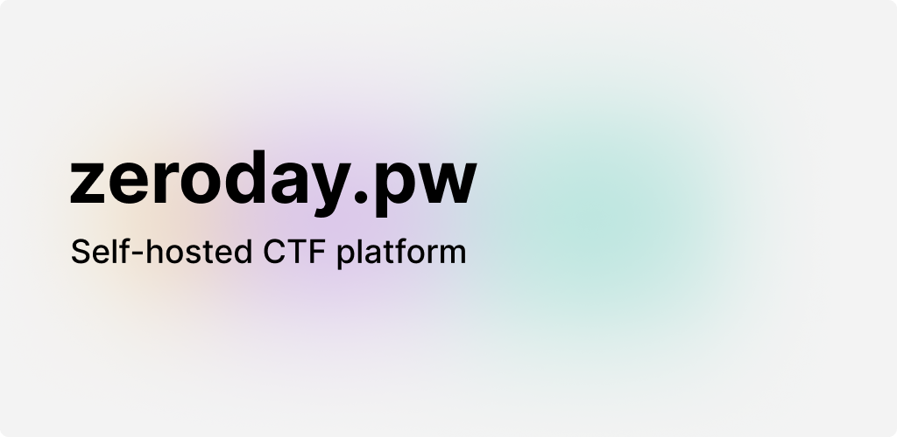

# Take Control of Your CTF Infrastructure

Organizers of Capture The Flag (CTF) events face the challenge of running secure
and engaging cybersecurity competitions. Their focus is to provide exciting and
creative challenges while ensuring a smooth event experience. These events often
take place at universities, meetups, or hackathons, requiring organizers to set
up technical infrastructure including networks, servers, user management, and
SSL certificate handling. All of this should be achievable with minimal effort
so the team can concentrate on what matters most — delivering an outstanding
experience for participants.

Additionally, data privacy plays a crucial role, especially for events in
Europe. Organizers must ensure that no unnecessary personal data is collected or
shared with third parties.

**zeroday.pw** is a purpose-built CTF platform designed to simplify the
technical and organizational hurdles of hosting onsite or fully digital
competitions. It uses Docker containers to isolate each challenge in its own
sandbox, allowing every participant to run their own instance securely without
interference. This isolation is essential for both fairness and security
throughout the event.

- **Minimal Setup:** Just provide a Kubernetes cluster — no complex
  installations or configurations required.
- **Intuitive Web Interface:** Participants can register easily, track event
  progress on a scoreboard, and view live challenge solves in a feed.
- **Scalable and Flexible:** Automatically scale the infrastructure by adding
  more nodes to the cluster, ensuring performance even with large participant
  numbers.
- **Full Data Control:** Self-host everything to maintain full control over your
  data and avoid reliance on third-party platforms.
- **Offline-Ready:** Once set up, the platform can run entirely locally, making
  it ideal for venues with limited or unstable internet connectivity.
- **Professional Presentation:** A modern interface enhances participant
  engagement and reflects well on your event.

## Quickstart

Set up `minikube` as your local development environment.  
The resource limits provided below are example values and can be adjusted to fit
your system specifications.

> [!NOTE]  
> `calico` is required to enable sandbox network isolation.

```bash
# Start cluster
$ minikube start --cni=calico --memory 8192 --cpus 6

# Create Docker image
$ docker build -t zeroday_portal:latest .
$ minikube image load zeroday_portal

# Deploy using Terraform
$ cd kubernetes/terraform
$ terraform apply

# Access your cluster
$ minikube tunnel

# Optional
$ minikube dashboard
```

Requesting the certificates may take a few minutes. During this time, the
Traefik proxy will temporarily use self-signed certificates. You can monitor the
certificate status in the cluster's event log.

## Terraform Configuration

Terraform variables can be declared in a persistent, declarative manner.  
To do this, create a `your_config_name.auto.tfvars` file which Terraform
automatically loads when executing commands.

Example configuration:

```terraform
cloudflare_api_token     = "YOUR API KEY"
cloudflare_email         = "YOUR EMAIL"
domain                   = "zeroday.pw"
letsencrypt_issuer_email = "support@zeroday.pw"
letsencrypt_environment  = "staging"
```

> [!CAUTION]
> Avoid setting the `letsencrypt_environment` to `production` unless absolutely necessary.  
> Production mode is subject to
> [Let's Encrypt rate limits](https://letsencrypt.org/docs/rate-limits/#certificate-issuance-limits),
> which can quickly be exceeded.

Each deployment requests multiple certificates:

- `domain.com`
- `portal.domain.com`
- `challenge.domain.com`, `*.challenge.domain.com`

To reduce the risk of rate limiting during frequent development changes, use the
`staging` environment, which offers much higher thresholds.

## Challenge Sandboxes

You can create custom challenge sandboxes using the sandbox Helm template. To
get started, build a Docker image for your challenge. Currently, only challenges
with a web interface are supported. You can configure resource limits and the
security context, including options such as a read-only filesystem and dropped
Linux capabilities.

Either configure your cluster to pull images from your (private) container registry,  
or load Docker images directly during development with using
`minikube image load <your-image>`.

For more information and a full list of configuration options, see the
[Helm values file](./kubernetes/helm/sandbox/values.yaml).

## Node Development

```bash
# Install dependencies
$ pnpm install

# Create database
$ cp .env.example .env && pnpm run db:push

# Start development server
$ pnpm dev

# Interactively edit the database (optional)
$ pnpm db:studio
```
